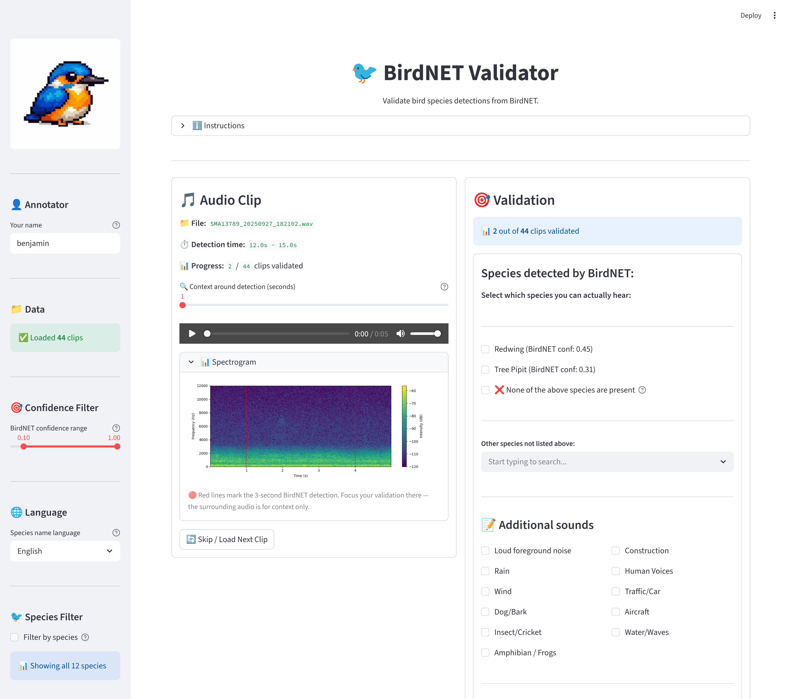

# BirdValidator

A Streamlit web application for **validating** bird species detections made by [BirdNET](https://github.com/birdnet-team/BirdNET-Analyzer) **or any model with a compatible output (see Expected Data Format)**. This is **not** a detection tool — you must first run **BirdNET** or other model with similar output on your audio recordings to produce result files. Once you have those results, point this app at your audio and result directories (locally or on S3), then listen to each detection and confirm or reject species identifications.

<p align="center">
  
</p>

## Features

- **Local & S3 support** — read audio and results from local directories or S3-compatible storage
- **Audio player & spectrogram** — listen to clips and visually inspect detections
- **Confidence & species filters** — focus on the detections that matter
- **Validation form** — confirm species, flag noise, rate your confidence
- **Auto-save** — validations are saved automatically to a CSV in your output directory
- **Resume support** — previously validated clips are skipped on restart
- **Peer review** — flag uncertain clips so other annotators can provide a second opinion

## Getting Started

### 1. Clone the repository

```bash
git clone https://github.com/NINAnor/birdnetValidator.git
cd birdnetValidator
```

### 2. Install dependencies

```bash
uv sync
```

### 3. Configure paths

Copy the example environment file and edit it with your paths:

```bash
cp .env.example .env
```

Set the three required directories in `.env`:

```dotenv
AUDIO_DIR=/path/to/your/audio/files
RESULTS_DIR=/path/to/your/birdnet/results
OUTPUT_DIR=/path/to/output
```

Paths can be local directories or S3 URIs (e.g. `s3://my-bucket/audio`). When using S3 paths, also fill in the S3 credentials:

```dotenv
S3_ENDPOINT_URL=https://your-s3-endpoint.com
S3_ACCESS_KEY=your-access-key
S3_SECRET_KEY=your-secret-key
```

### 4. Run the app

```bash
uv run streamlit run src/dashboard.py
```

Then open [http://localhost:8501](http://localhost:8501) in your browser.

### 5. Validate

1. Adjust confidence threshold and species filters in the sidebar
2. Listen to each clip, check the spectrogram, and submit your validation
3. Validations are saved automatically to `birdnet_validations.csv` in your output directory
4. Use the download button to grab the CSV at any time

## Expected Data Format

### Audio files

`.wav`, `.flac`, `.mp3`, `.ogg` — any standard audio format supported by librosa.

### Detection result files

Tab-separated `.txt` files with **at least** the following columns:

| Column | Description | Example |
|--------|-------------|---------|
| `Begin Time (s)` | Detection start time in seconds from the beginning of the audio file | `12.0` |
| `End Time (s)` | Detection end time in seconds | `15.0` |
| `Common Name` | Species common name (English) | `Eurasian Blackbird` |
| `Species Code` | Short species code | `eurbla1` |
| `Confidence` | Model confidence score (0.0–1.0) | `0.87` |
| `Begin Path` | Path to the source audio file | `/data/audio/site1/recording.wav` |

This is the default output format of [BirdNET-Analyzer](https://github.com/birdnet-team/BirdNET-Analyzer), but **any classifier that produces tab-separated `.txt` files with these columns will work**. If you use a different model, just make sure its output includes the columns above. Rows where `Common Name` is `nocall` are automatically ignored.

Example (tab-separated):

```
Selection	View	Channel	Begin Time (s)	End Time (s)	Low Freq (Hz)	High Freq (Hz)	Common Name	Species Code	Confidence	Begin Path	File Offset (s)
1	Spectrogram 1	1	0.0	3.0	0	15000	Eurasian Blackbird	eurbla1	0.87	/data/audio/rec.wav	0.0
2	Spectrogram 1	1	3.0	6.0	0	15000	Common Chaffinch	comcha	0.42	/data/audio/rec.wav	3.0
```

> [!NOTE] 
> Extra columns (like `Selection`, `View`, `Channel`, `Low Freq (Hz)`, `High Freq (Hz)`, `File Offset (s)`) are ignored — only the six required columns matter.

## Suggested Workflow

How you validate depends on your research question. Below are two common strategies and advice for teams.

### Goal 1: Species richness (presence/absence)

If you want to know **which species are present** at a site, you don't need to validate every detection — focus on high-confidence ones and confirm a subset per species.

1. Set the **confidence range** to a high lower bound (e.g. 0.7–1.0)
2. Use the **species filter** to work through one species at a time
3. Validate **~20–30 clips per species** — enough to confirm that the species is genuinely present at the site
4. If most detections for a species are false positives, raise the threshold; if they are all correct, you can trust BirdNET for that species at that confidence level

### Goal 2: Calibration curve (precision by confidence bin)

If you want to **quantify BirdNET's accuracy** for each species — i.e. determine the confidence threshold at which precision reaches an acceptable level (e.g. 90%) — you need to sample across the full confidence range.

1. Divide the confidence range into bins (e.g. 0.1–0.2, 0.2–0.3, …, 0.9–1.0)
2. For each bin, set the **confidence range** slider accordingly
3. Validate **~30–50 clips per bin per species** — this gives you a reliable estimate of precision at each confidence level
4. After validation, compute precision per bin: `true positives / (true positives + false positives)`
5. Plot confidence vs. precision to find the threshold where accuracy meets your requirements

### Working with multiple annotators

The app supports multiple annotators out of the box — each person enters their name in the sidebar, and validations are saved to separate files (`birdnet_validations_{name}.csv`). Clips validated by any annotator are skipped for everyone.

If an annotator is **unsure** about a clip, they can tick **🔄 Request peer review** before submitting. The clip is saved to their file (so they won't see it again), but it **remains visible to all other annotators** for a second opinion. The `peer_review` column in the output CSV marks which clips were flagged.

To divide the workload efficiently:

- **Split by species** — assign each annotator a subset of species using the species filter. This avoids overlap and works well when annotators have different taxonomic expertise
- **Split by confidence bin** — one annotator handles 0.1–0.5, another 0.5–1.0. Useful for calibration workflows where you need even coverage across bins
- **Redundant annotation** — for inter-annotator agreement analysis, have 2+ annotators validate the same clips. The `annotator` column in the output lets you compare their assessments. To enable this, each annotator's validated clips won't be skipped for the others — they need to point to separate output directories or you can clear and re-scan as needed

## Docker

The app can be containerised for deployment on a shared server, so multiple annotators can access it from their browser without installing anything locally. Build and run with:

```bash
docker compose up --build
```

Configure paths and S3 credentials via environment variables in `docker-compose.yml` or a `.env` file mounted into the container.

## Contact

For questions or contributions, please contact [benjamin.cretois@nina.no](mailto:benjamin.cretois@nina.no). Feel free to open issues or pull requests.
